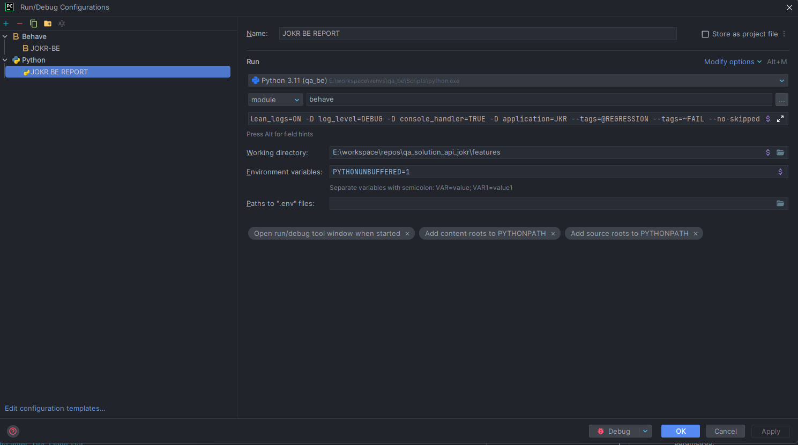

# JOKR BE Solution

## Indice

- [Configuracion del Proyecto](#configuracion)
- [Allure Reports](#allure-reports)
    - [Instalacion](#instalacion)
    - [Generando los reportes](#generando-los-reportes)
- [Execution Tags](#execution-tags)

----

### Configuracion

#### Configurar Virtual Environment:

- **Windows**:

  Para la configuracion de nuestro entorno virtual, crearemos un directorio con el nombre que deseemos, en este caso **"
  venvs"**
   ```pwsh
   mkdir venvs
   ```
  Luego de crear el directorio, nos ubicamos dentro de el y creamos nuestro entorno virtual con el siguiente comando:
   ```pwsh
   python -m venv jokr_be
   ```
  Luego de crear el entorno virtual, desde la terminal ejecutamos el siguiente comando:
   ```pwsh
   cd .\jokr_be\Scripts\ && ./Activate.ps1
   ```
  Luego de activar el entorno virtual, debemos dirigirnos al root de nuestro projecto e instalar las dependencias con el
  siguiente comando:
     ```pwsh
        pip install -r requirements.txt
    ```
- **MacOs**:

> **WIP**

- **Linux**:

> **WIP**

Una vez hecho esto, procedemos a configurar el IDE, para ello debemos ir a **File -> Settings -> Project:
qa_solution_api_jokr -> Project Interpreter**
> *Nota*: Esta configuracion es para el IDE Pycharm, en caso de utilizar otro IDE, la configuracion puede variar.

Una vez dentro del menu de configuracion del interprete, debemos seleccionar el interprete que acabamos de crear, en
este caso **jokr_be**.


Como nosotros ya creamos previamente el interprete con el comando python -m venv jokr_be, debemos seleccionar la
opcion **Existing** y en el menu de los 3 puntitos buscamos el path al interprete de python de nuestro entorno virtual


El interprete estara ubicado dentro de la carpeta **/venvs/jokr_be/Scripts/**


Luego de seleccionar el interprete, debemos darle click en **OK**, luego en **OK** nuevamente y por ultimo **Apply**.

Una vez terminada la configuracion del interprete, procedemos con la configuracion de ejecucion de los test. Para esto
nos dirijimos a la opcion que se nos muestra en la barra de herramientas del IDE ubicada en la parte superior derecha.


Luego de darle click a la opcion, nos aparecera un menu, en el cual debemos darle click a **Edit Configurations...**
Una vez dentro del menu de configuracion de ejecucion, debemos darle click al boton **+** y seleccionar la opcion
Behave o Python.


Una vez seleccionado el tipo de configuracion de ejecucion a utilizar, debemos configurar los parametros de ejecucion.

- Para la configuracion de Behave, debemos configurar los siguientes parametros:
    - **Name:** Nombre de la configuracion de ejecucion.
    - **Feature files:** Path a la carpeta de los features.
    - **Additional Arguments:** Argumentos adicionales para la ejecucion de los test.
    - **Environment variables:** Variables de entorno para la ejecucion de los test (seleccionar el que corresponde
      a nuestro entorno virtual creado).
    - **Python interpreter:** Interprete de python a utilizar para la ejecucion de los test.
    - **Working directory:** Path al directorio de trabajo.
    - **Before launch:** Comandos a ejecutar antes de la ejecucion de los test.

  

- Para la configuracion de Python, debemos configurar los siguientes parametros:
    - **Name:** Nombre de la configuracion de ejecucion.
    - **Module:** Modulo a ejecutar (behave).
    - **Script parameters:** Parametros del script (features).
    - **Environment variables:** Variables de entorno para la ejecucion de los test.
    - **Python interpreter:** Interprete de python a utilizar para la ejecucion de los test (seleccionar el que
      corresponde a nuestro entorno virtual creado).
    - **Working directory:** Path al directorio de trabajo.

  

Una vez configurados los parametros, debemos darle click en **OK** y luego en **Apply**.

#

> **Parametros de ejecucion:** -D environment=qa -D clean_logs=ON -D log_level=DEBUG -D console_handler=TRUE
> --tags=ORDER_SMOKE -D application=jkr --no-skipped

----

## Allure Reports

### Instalacion

Primer debemos instalar allure en nuestra pc o en el servidor, podemos hacerlo con el siguiente comando:

- MacOs:

    ```sh
    brew install allure
    ```

- Windows:
  Para instalar allure en windows, debemos instalar scoop, para ello debemos ejecutar los siguientes comandos en
  powershell:

    ```powershell
    Set-ExecutionPolicy RemoteSigned -scope CurrentUser
    iex (new-object net.webclient).downloadstring('https://get.scoop.sh')
    ```

    - Luego de instalar scoop, debemos instalar allure con el siguiente comando:

      ```sh
      scoop install allure
      ```

- Para linux, podemos instalarlo con el siguiente comando:

    ```sh
    sudo apt-add-repository ppa:qameta/allure
    sudo apt-get update
    sudo apt-get install allure
    ```

### Generando los reportes

**Para generar los reportes, debemos ejecutar en la terminal el siguiente comando:**

```sh
python -m behave -f allure_behave.formatter:AllureFormatter -o ./reports/allure-results -D environment=qa -D clean_logs=ON -D log_level=DEBUG -D console_handler=TRUE --tags=ORDER_SMOKE -D application=jkr --no-skipped ./features
```

> Esto nos generara el json con el resultado de la ejecucion dentro de la carpeta reports/allure-results

**Para generar el codigo que se visualiza con el comando siguiente, debemos ejecutar el siguiente comando:**

> **Nota:** Este comando es opcional, ya que el reporte se puede visualizar con el comando siguiente. Este comando puede
> utilizarse si se desea ver el codigo que se genera para el reporte.

```sh
allure generate --clean -o allure-report allure-results
```

> Luego de ejecutado el comando se deberia generar la carpeta allure-report con el reporte generado.

**Para visualizar el reporte debemos ejecutar el siguiente comando:**

```sh
allure serve reports/allure-report
```

> Esto nos abrira un servidor local con el reporte generado, en caso de que no se abra automaticamente, podemos acceder
> a el desde el navegador con la siguiente url: <http://localhost:port> (por default es 3000).

----

## Execution Tags

- **@SMOKE_TEST:** Ejecuta los test de smoke.
- **@REGRESSION:** Ejecuta todos los tests de la solucion.
- **@{FEATURE_NAME}:** Ejecuta todos los tests de la feature especificada.
- **@{TEST ID}:** Ejecuta el test especificado.

> **Nota:** Los tags se pueden combinar para ejecutar los tests que se deseen. Ejemplo: --tags=ORDER_SMOKE --tags=LOGIN.

> Los ids de los tests se corresponden con el id del test case en Azure DevOps.